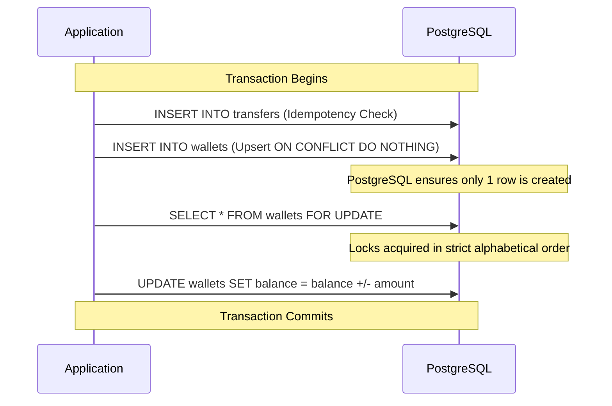

# Architecture & Design: Paytm Wallet & P2P Transfer Service

## 1. Overview
This document outlines the architectural decisions, concurrency controls, and system design for the Wallet & P2P Transfer Service. The system is built with a focus on absolute correctness under concurrent load, strict adherence to ACID properties, and zero data loss or money creation.

**Technology Stack:** Java 21, Spring Boot, Spring Security, Spring JDBC, PostgreSQL, Flyway, Docker, Render, Neon, Micrometer (JSON Logging, Prometheus metrics).

## 2. Data Model

The data model uses PostgreSQL as the source of truth.

- **`wallets`**: Stores the user's balance in integer paise.
  - `user_id` (VARCHAR, PK): The unique identity derived from the JWT.
  - `balance_paise` (BIGINT): The user's balance. Constrained by a `CHECK (balance_paise >= 0)`.
  - `created_at`, `updated_at`: Audit timestamps.
  
- **`transfers`**: Records money movement and acts as the idempotency guard.
  - `id` (UUID, PK): Primary identifier.
  - `idempotency_key` (VARCHAR): Provided by the client.
  - `from_user_id` (VARCHAR, FK -> wallets): The sender.
  - `to_user_id` (VARCHAR, FK -> wallets): The recipient.
  - `amount_paise` (BIGINT): The amount. Constrained by a `CHECK (amount_paise > 0)`.
  - `created_at`: Audit timestamp.
  - **Constraint:** `UNIQUE (from_user_id, idempotency_key)` to guarantee that a user cannot reuse an idempotency key across different transactions.

## 3. Concurrency: The Get-or-Create + Transfer Race

**The Problem:** Two concurrent first-transfers initiated between the same brand-new user pair can cause a classic find-or-create race condition. If both requests read the database, observe the wallet is missing, and attempt to insert simultaneously, one will throw a Unique Constraint Violation (500 error), breaking the API contract.

**The Simplest Correct Mechanism:**
To ensure `get-or-create` is race-free, the application avoids read-then-write patterns completely. Instead, it leans on PostgreSQL's atomic UPSERT capabilities:

```sql
INSERT INTO wallets (user_id, balance_paise) VALUES (:to_user_id, 0)
ON CONFLICT (user_id) DO NOTHING;
```

**Why is this the best approach?**
It is a single, atomic operation handled natively by the database engine. If ten concurrent requests try to create the wallet, the first one succeeds and the other nine gracefully execute `DO NOTHING` without throwing exceptions or corrupting state.



**Rejected Heavier Alternatives:**
1. **Serializable Transaction Isolation:** Setting isolation level to `SERIALIZABLE` would prevent the race but at the cost of significantly reduced throughput and complex application-level retry logic (`@Retryable`) to handle serialization anomalies (deadlocks/aborts).
2. **Explicit Table Locks / Distributed Locks:** Taking an exclusive lock on the `wallets` table or using a distributed lock (e.g., Redis) introduces unnecessary operational complexity, potential single points of failure, and severely throttles concurrency.

**Deadlock Prevention on Balance Mutation:**
When deducting from the sender and adding to the receiver, two concurrent reciprocal transfers (A -> B and B -> A) could deadlock if row locks are acquired in different orders. This is prevented by deterministically ordering the `UPDATE` statements alphabetically by `user_id`, ensuring all transactions acquire locks uniformly.

## 4. Idempotency Management

Idempotency is crucial to ensure that a retried request (due to a network timeout) does not move funds twice.

- **Storage:** The idempotency key sits directly alongside the transfer payload in the `transfers` table, protected by a `UNIQUE(from_user_id, idempotency_key)` constraint.
- **Placement relative to Balance Mutation:** The idempotency check is performed at the *very beginning* of the database transaction, before any balances are locked or mutated. We use an atomic insert:
  ```sql
  INSERT INTO transfers (id, idempotency_key, from_user_id, to_user_id, amount_paise) ...
  ON CONFLICT (from_user_id, idempotency_key) DO NOTHING RETURNING id;
  ```
- **Same-key-different-body Detection:** If the above `INSERT` returns no ID, it means the key already exists (a replay). The service then queries the existing `transfer` row. If the `to_user_id` and `amount_paise` match the current request, it returns the original successful outcome. If they differ, it strictly returns a `409 Conflict`.
- **Expiration:** Since space is cheap and idempotency collisions are catastrophic, keys are not aggressively expired. If unbounded growth becomes an issue, a background job can partition and archive old records, but they are kept indefinitely for this scope.

## 5. Identity & Authorization

- **Token-Based Auth:** Authentication is handled statelessly via a Spring Security Filter intercepting every request.
- **Symmetric JWT Verification:** The filter verifies the JWT using a symmetric signing key (HMAC SHA-256). 
- **Identity Extraction:** The caller's identity is extracted directly from the verified token's subject (`sub` claim) and injected into the `SecurityContext`.
- **Strict Boundary:** The `from_user_id` for any transfer or account lookup is *never* accepted from a trusted header, URL path, or request body. The service only ever operates on the `SecurityContextHolder.getContext().getAuthentication().getName()`.

## 6. Consistency vs. Availability

**Decision:** Strict Consistency over Availability.

In a money movement workload, the cost of inconsistency (double-spending, torn transfers, lost money) infinitely outweighs the cost of downtime.
- **Write Path:** The system relies entirely on synchronous, ACID-compliant database transactions. If the primary PostgreSQL instance is slow or partitioned, the service will reject requests (HTTP 503) rather than degrading to a split-brain state, buffering in a message queue, or acknowledging a transfer before it is durably committed.
- **Read Path (`GET /accounts/me`):** Reads are strongly consistent. They query the primary database directly. Eventual consistency via read-replicas is rejected because a user must reliably see their balance drop immediately after a successful transfer.

## 7. Edge Cases Handled

1. **Insufficient Funds:** A database-level `CHECK (balance_paise >= 0)` constraint exists, but the application also executes `UPDATE ... WHERE balance_paise >= :amount`. If 0 rows are updated, it throws an `InsufficientFundsException` (HTTP 400), rolling back the transaction.
2. **Self-Transfer:** Validated at the controller level. Attempting to send money to oneself returns HTTP 400.
3. **Negative/Zero Amount:** Handled by a database `CHECK (amount_paise > 0)` and Spring Boot `@Valid` / `@Positive` annotations at the API boundary, returning HTTP 400.
4. **Unknown Recipient:** Automatically handled by the race-free `get-or-create` mechanism. The recipient's wallet is safely initialized to 0 before the transfer executes.
5. **Test Funding Bootstrapping:** Since the API deliberately lacks a deposit endpoint to maintain a small surface area, the initial balances for the concurrent burst test are bootstrapped via a direct database script.

## 8. Containerization, Deployment & Observability

- **Containerization:** A multi-stage Dockerfile builds the application from source. The final image runs as a non-root user and uses a minimal JRE base for a small attack surface. `docker-compose.yml` orchestrates the application and the database.
- **Deployment:** The application is deployed on Render (Free Tier), backed by a Neon Serverless PostgreSQL instance (Free Tier). All sensitive configurations are injected via 12-factor environment variables.
- **Observability:** 
  - **Structured JSON Logging:** Logback is configured with a JSON encoder. 
  - **Correlation IDs:** Every request generates a unique correlation ID, included in all logs for distributed tracing.
  - **Meaningful Events:** Logs explicitly capture domain events like `TRANSFER_APPLIED`, `INSUFFICIENT_FUNDS_REJECTED`, `IDEMPOTENT_REPLAY`, and `AUTH_FAILURE`.
  - **Metrics:** Micrometer provides an `/actuator/prometheus` endpoint tracking request rates, latencies (p99), and error rates.

## 9. Cost & AI Usage Note

- **Cost:** Rs 0. Hosted entirely on free tiers (Render Web Service Free Tier, Neon PostgreSQL Free Tier).
- **AI Usage:** Directed: AI was instructed to implement a specific race-free concurrency pattern (`INSERT ... ON CONFLICT`) and deterministic row locking for the database layer, as well as enforcing symmetric JWT signing and exact HTTP status codes. Decided: AI generated the Spring Boot boilerplate, Flyway migration syntax, and Dockerfile configurations based on standard best practices.
